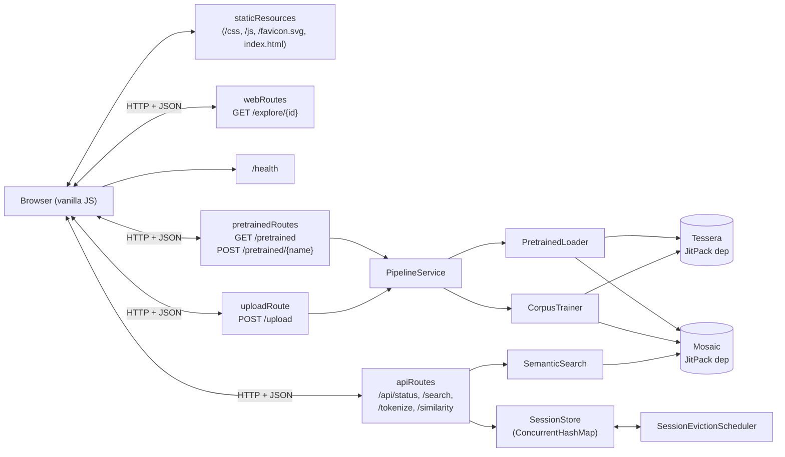

# nlp-kotlin-playground — Architecture

This document explains how the playground is wired together: the request flow, the in-memory session model, how Tessera and Mosaic plug in, and the packaging/distribution decisions. It is aimed at contributors and at readers who want to understand the design before reading code.

---

## 1. What this project is (and is not)

It is a **Kotlin/JVM web application** — a Ktor server that exposes a small JSON API and serves a static HTML/JS frontend. It is *not* a library: nothing here is published to a Maven coordinate, and there is no public Kotlin surface intended for external consumers.

Its purpose is to make two sister libraries — [Tessera](https://github.com/HectorIFC/tessera) (BPE tokenizer) and [Mosaic](https://github.com/HectorIFC/mosaic) (lookup-based embeddings) — **tangible** in a browser, end to end, in one Docker container.

The pipeline is real:

```text
text → Tessera (tokenize) → token IDs → Mosaic (lookup) → vectors
                                                              ↓
                                  mean pool → query vector / sentence vectors
                                                              ↓
                                                    cosine similarity → top-K
```

The embeddings are **randomly initialized** (Mosaic is a lookup table, not a trained model). The disclaimer surfaces in every page of the UI and in the README. Training is a separate future project.

---

## 2. High-level diagram



---

## 3. Request flow: search

`POST /api/search/{sessionId}` is the canonical end-to-end path.

```text
1. Ktor routes the request to apiRoutes → searchEndpoint(ctx).
2. requireReadyPipeline(ctx) resolves {sessionId} against SessionStore.
   - missing      → 404 ErrorResponse("Unknown session")
   - TRAINING     → 409 "Session still training"
   - ERROR        → 409 "Session failed to build"
   - READY        → returns the Pipeline (tokenizer + embeddings + sentences)
3. The request body { query, topK } is decoded as SearchRequest;
   blank query or topK ≤ 0 → 400.
4. SemanticSearch.search(pipeline, query, topK) runs:
   a. dev.mosaic.TesseraEmbeddings(pipeline.tokenizer, pipeline.embeddings)
   b. queryVector = encodeMeanPooled(query)
   c. for each sentence in pipeline.sentences:
        sentenceVector = encodeMeanPooled(sentence)
        score          = VectorOps.cosineSimilarity(queryVector, sentenceVector)
   d. sort by score desc, take topK
5. Response: { query, results: [{ sentence, score }, …] }
```

All non-trivial work happens inside the Tessera/Mosaic JARs; this project orchestrates and exposes.

---

## 4. The session model

Each upload or pre-trained-corpus selection creates a **session**: an opaque UUID that maps to a `Pipeline` snapshot in memory.

| Concern | Implementation |
|---|---|
| Storage | `ConcurrentHashMap<String, SessionEntry>` in [`SessionStore`](./src/main/kotlin/dev/nlpplayground/session/SessionStore.kt) |
| States  | `TRAINING` (upload running), `READY` (Pipeline usable), `ERROR` (training failed) |
| Time-based eviction | Entries older than `maxAge` (default 1 h) are removed by `evictOld()` |
| Capacity eviction   | When `maxSessions` (default 50) is exceeded, the oldest entry is dropped |
| Background sweep    | `SessionEvictionScheduler` runs `evictOld()` every 10 minutes on a daemon thread |

Sessions are **never persisted**. Restarting the JVM (or the container) discards everything. This is intentional: the playground is a single-instance demo, not a tenant-aware service. The `Clock` is injected so eviction is deterministic under test.

`Pipeline` is the unit of state:

```kotlin
internal data class Pipeline(
    val name: String,
    val tokenizer: BpeTokenizer,     // from dev.tessera
    val embeddings: EmbeddingTable,  // from dev.mosaic
    val sentences: List<String>,
)
```

---

## 5. How Tessera and Mosaic plug in

Both libraries are JitPack dependencies, declared in [`build.gradle.kts`](./build.gradle.kts):

```kotlin
implementation("com.github.HectorIFC:tessera:v0.0.7")
implementation("com.github.HectorIFC:mosaic:v0.0.4")
```

Nothing from them is re-implemented. The integration class `dev.mosaic.TesseraEmbeddings` already exists in Mosaic; the playground uses it directly for mean-pooled encoding.

### Pre-trained corpora

Three corpora ship in `src/main/resources/pretrained/<name>/`:

```text
alice-in-wonderland/
├── corpus.txt              # 151 KB — Project Gutenberg #11, license stripped
├── tessera.json            # 175 KB — trained tokenizer (2000 BPE merges)
├── mosaic.bin              # 1.16 MB — 2257-vocab × 128-dim random embeddings (seed 42)
└── mosaic.bin.meta.json    # 293 B — Mosaic's metadata sidecar
shakespeare-sonnets/        # same layout, Project Gutenberg #1041
kotlin-stdlib-docs/         # same layout, KDoc blocks extracted from 7 stdlib files
```

These are produced by a dedicated **pretrainer source set** (`src/pretrainer/kotlin/`), run via `./gradlew runPretrain`. The task lives outside the production JAR — it is dev tooling, not runtime code. Outputs are deterministic given the inputs (same seed, same merges, same cleaning) and are committed to the repo so the JAR is self-contained.

`PretrainedLoader` reads them at startup by copying the three classpath resources to a temp directory (because both `BpeTokenizer.load` and `EmbeddingTable.load` take a `File`/`String` path, not an `InputStream`), then parses with the library APIs and deletes the temp files.

### Uploaded corpora

`UploadRoute` accepts `multipart/form-data` with a single `file` part:

1. Reads up to **2 MB + 1 byte** anything more → `413 Payload Too Large`.
2. Strips a UTF-8 BOM if present, then **strict-decodes** as UTF-8 (`CodingErrorAction.REPORT`). Any malformed byte → `400 "File must be UTF-8 encoded"`.
3. Generates an internal name `upload-<8hex>` (the upload's own filename is never used).
4. Creates a `TRAINING` session, returns `202 Accepted` immediately.
5. Launches a background coroutine on `Dispatchers.Default` that runs `CorpusTrainer.train(...)`:
   - `Trainer(TrainingConfig(numMerges = 2000)).train(corpus)`
   - `EmbeddingTable.create(vocabSize, embeddingDim = 128, initializer = Initializer.uniformDefault(seed = 42))`
   - splits the corpus into sentences with `Regex("[.!?\\n]+")` filtered to length > 10
6. On completion: `SessionStore.markReady(id, pipeline)` or `markError(id, msg)`.

The frontend polls `GET /api/status/{sessionId}` every 1 s until the state is no longer `training`.

---

## 6. HTTP module layout

```text
src/main/kotlin/dev/nlpplayground/
├── Application.kt                # EngineMain + module() + moduleWith(ctx)
├── AppContext.kt                 # PipelineService + SessionStore + Scheduler
├── Routing.kt                    # installs StatusPages + mounts all routes + staticResources
├── pipeline/
│   ├── Pipeline.kt
│   ├── PipelineService.kt        # facade: loadPretrained / trainFromCorpus
│   ├── PretrainedLoader.kt       # classpath → temp file → BpeTokenizer/EmbeddingTable
│   ├── CorpusTrainer.kt          # Trainer + EmbeddingTable.create + sentence split
│   └── SemanticSearch.kt         # search / similarity / tokenize using TesseraEmbeddings
├── session/
│   ├── SessionStore.kt           # ConcurrentHashMap, eviction, capacity cap
│   └── SessionEvictionScheduler.kt
└── routes/
    ├── Dtos.kt                   # @Serializable request/response DTOs
    ├── HealthRoute.kt            # GET /health
    ├── PretrainedRoute.kt        # GET /pretrained, POST /pretrained/{name}
    ├── UploadRoute.kt            # POST /upload (multipart, 2 MB, UTF-8 strict)
    ├── ApiRoute.kt               # /api/status, /api/search, /api/tokenize, /api/similarity
    └── WebRoute.kt               # GET /explore/{sessionId} (dynamic; static handles the rest)
```

`StatusPages` maps `IllegalArgumentException` → `400` and any uncaught `Throwable` → `500`. The route handlers handle their own happy/edge paths explicitly (404, 409, 413, 400) so most responses never hit `StatusPages`.

---

## 7. Frontend

The frontend is intentionally framework-free: vanilla ES modules served from `src/main/resources/static/`.

```text
static/
├── index.html       # home: pre-trained list + upload form + disclaimer
├── explore.html     # tabs (Search / Tokenize / Compare) — sessionId read from URL
├── favicon.svg      # brand mark: indigo "Tessera" + descending orange "Mosaic" cells
├── css/main.css     # dual-accent palette: indigo for Tessera, orange for Mosaic
└── js/
    ├── api.js       # thin fetch wrapper (JSON + multipart)
    ├── home.js      # pretrained list, upload + polling redirect
    ├── explore.js   # tab switcher + session header
    ├── search.js
    ├── tokenize.js
    └── compare.js
```

Each tab is its own module wired in `explore.js`; there is **no global state** . Tabs animate in via a single `@keyframes fade-in-up` rule; results stagger by row index.

---

## 8. Distribution

A multi-stage `Dockerfile` builds in `eclipse-temurin:21-jdk-jammy` and ships in `eclipse-temurin:21-jre-jammy`:

- Stage 1 copies the wrapper, sources, and config, runs `./gradlew installDist`.
- Stage 2 installs `wget` (needed by `HEALTHCHECK`), copies the install directory, and sets the `ENTRYPOINT`.
- The healthcheck pings `/health` every 30 s after a 15 s grace period.

The release workflow (`.github/workflows/release.yml`) is adapted from Tessera's pattern:

1. `mathieudutour/github-tag-action` (dry-run) computes the next SemVer from conventional commits.
2. `sed` bumps `gradle.properties`, the `org.opencontainers.image.version` label, and the README.
3. `./gradlew build` verifies the bump compiles + tests.
4. `docker/login-action` + `docker/build-push-action` push `ghcr.io/hectorifc/nlp-kotlin-playground:vX.Y.Z` and `:latest` with cache-from/to GHA.
5. The version commit is pushed to `main` with `[skip ci]`, the tag is created, and a GitHub Release is opened.

`Dependabot` keeps Gradle deps, GitHub Actions, and the Docker base image current weekly.

---

## 9. Design decisions

| Decision | Rationale |
|---|---|
| **Ktor 3.x** over Spring/Micronaut | Idiomatic Kotlin, near-zero boot time, small image. Pure stdlib + Netty. |
| **Single-module Gradle** | Unlike Tessera/Mosaic, the playground is one deliverable — no library, no CLI. A second source set (`pretrainer`) exists only for dev tooling. |
| **In-memory sessions** | A real cache (Redis, Postgres) would dwarf the rest of the app. Eviction + cap is enough for a single-instance demo. |
| **Pre-trained corpora committed** | Regenerating on every build is slow and non-deterministic across environments. Committing the artifacts makes the JAR self-contained. |
| **Vanilla JS** | A 3-tab UI doesn't justify a SPA framework. The whole frontend is ~500 lines including CSS; reading it requires no toolchain. |
| **GHCR over Docker Hub** | Free private images, single auth surface, no rate limits for `docker pull` from public repos. |
| **JitPack over Maven Central** for Tessera/Mosaic | Both sister projects are already on JitPack; no extra publication step is needed. The playground consumes whatever tag exists. |
| **YAML config (`application.yaml`)** | Ktor 3 moved HOCON to a separate artifact; YAML is now the lighter-touch default. |
| **No CORS** | Frontend and backend share an origin. CORS would be dead code. |

---

## 10. References

- Tessera — [github.com/HectorIFC/tessera](https://github.com/HectorIFC/tessera) · [ARCHITECTURE.md](https://github.com/HectorIFC/tessera/blob/main/ARCHITECTURE.md)
- Mosaic — [github.com/HectorIFC/mosaic](https://github.com/HectorIFC/mosaic) · [ARCHITECTURE.md](https://github.com/HectorIFC/mosaic/blob/main/ARCHITECTURE.md)
- Ktor docs — <https://ktor.io/docs/>
- GHCR — <https://docs.github.com/en/packages/working-with-a-github-packages-registry/working-with-the-container-registry>
- Conventional Commits — <https://www.conventionalcommits.org/>
