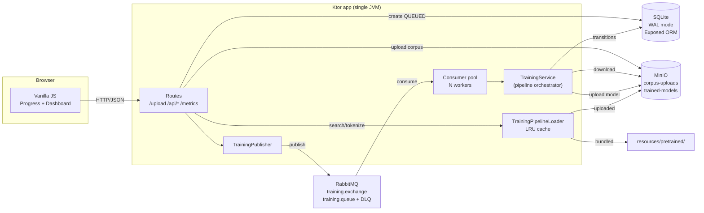

# nlp-kotlin-playground — Architecture (v0.1.0)

This document explains how the playground is wired together: the four-container topology, the request flow from upload to ready, the state machine that drives every training, the idempotency guarantees, and the rationale behind each component choice. It is aimed at contributors and at readers who want to understand the design before reading code.

For the v0.0.x architecture (synchronous, in-memory, single container), see the git history at tag `v0.0.3`. v0.1.0 is a deliberate breaking redesign.

---

## 1. What this project is (and is not)

It is a **Kotlin/JVM web application** plus its supporting services, packaged as a Docker Compose stack:

- One Ktor app that serves the HTML frontend, the JSON API, and the consumer workers in the same JVM.
- One MinIO container for blob storage.
- One RabbitMQ container for the work queue.
- One SQLite file persisted in a Docker volume (no separate database container).

It is **not** a library. Nothing here is published to a Maven coordinate; consumers run the published Docker image, not link against Kotlin classes.

The purpose is to make two sister libraries — [Tessera](https://github.com/HectorIFC/tessera) (BPE tokenizer) and [Mosaic](https://github.com/HectorIFC/mosaic) (lookup-based embeddings) — **tangible** through a realistic distributed-systems story: queue-driven processing, durable state, observability, graceful shutdown. The pipeline itself (tokenize → embed → mean-pool → cosine) is the same as v0.0.x; only the orchestration changed.

The embeddings are **randomly initialized** (Mosaic is a lookup table, not a trained model). The disclaimer surfaces in every page of the UI and in the README. Training is a separate future project.

---

## 2. High-level topology



Everything inside the dotted region (the Ktor app) is a single JVM process — the consumer pool runs in the same address space as the HTTP routes. Externally there are only three other containers (`minio`, `rabbitmq`, and the one-shot `minio-init` that creates buckets).

---

## 3. Request flow: upload → ready → search

### Producer side (HTTP thread)

```text
POST /upload (multipart file)
  ├─ validate: size ≤ 2 MB, UTF-8 strict, non-blank
  ├─ generate trainingId = UUID
  ├─ MinIO.upload(corpus-uploads, "{trainingId}.txt", bytes)
  ├─ TrainingRepository.create(QUEUED, blob_key, size, filename)
  ├─ TrainingPublisher.publish({trainingId, blob_key, submitted_at})
  └─ respond 202 { trainingId, status, statusUrl, progressUrl }
```

If MinIO is unreachable: 500, no DB row, no message. If publish fails: the DB row is moved to FAILED, response is 500. The two operations are deliberately *not* an atomic outbox — for the playground scale, best-effort plus the 1-day MinIO TTL is cheaper than introducing a transactional outbox.

### Consumer side (worker thread)

`TrainingService.process(message)` (PRD §4.8):

```text
1. SQLite.findById(message.trainingId)
   - missing      → SKIPPED (ack, discard)
   - terminal     → SKIPPED (already READY/FAILED/EXPIRED, idempotent re-delivery)
   - intermediate → reprocess from scratch
   - QUEUED       → proceed
2. SQLite.updateStatus(DOWNLOADING)
3. MinIO.download(corpus-uploads/{key}) → tempfile (cleaned up in finally)
4. SQLite.updateStatus(TOKENIZING)
5. Trainer.train(corpus)  ← Tessera + Mosaic, same code as v0.0.x
6. SQLite.updateStatus(EMBEDDING)
7. SQLite.updateStatus(INDEXING)
8. MinIO.upload(trained-models/{id}/tessera.json | mosaic.bin | mosaic.bin.meta.json | corpus.txt)
9. SQLite.updateStatus(READY, expiresAt=now+24h)
10. MinIO.delete(corpus-uploads/{key})
11. consumer.basicAck()
```

Any uncaught exception on the worker → `markFailed()` + `basicNack(requeue=false)` → DLX → DLQ. The tempfile in step 3 is always deleted in a `finally` block; SIGKILL-style crashes will leak (Docker volumes inside containers don't persist `/tmp` across restarts anyway, so this is bounded).

### Search request flow

```text
POST /api/search/{trainingId}
  ├─ SQLite.findById(trainingId)
  ├─ training.status == READY ?
  │    → TrainingPipelineLoader.resolve(training)
  │      - if corpus_blob_key starts with "bundled:" → PretrainedLoader (classpath)
  │      - else → download tessera.json + mosaic.bin + meta + corpus.txt from MinIO
  │              and cache (LRU, 16 entries)
  ├─ training.status == EXPIRED → 410 Gone
  ├─ training.status == FAILED → 409 Conflict with errorMessage
  └─ otherwise (in-progress) → 409 Conflict "still training"
```

Tokenize and similarity share the same resolver.

---

## 4. State machine

Eight states; the linear forward chain plus a universal shortcut to FAILED, plus a one-way decay from READY to EXPIRED (PRD §4.4 / §6.12).

```text
QUEUED ─► DOWNLOADING ─► TOKENIZING ─► EMBEDDING ─► INDEXING ─► READY ─► EXPIRED
   │           │            │            │           │           (TTL)
   │           │            │            │           │
   └───────────┴────────────┴────────────┴───────────┴─► FAILED
```

Transitions are validated by `TrainingStateMachine.assertValidTransition` on every `updateStatus` call. **Same-state transitions are idempotent no-ops** so the consumer can safely replay an interrupted run from any intermediate state without violating the machine.

`FAILED` and `EXPIRED` are terminal — never move again. `EXPIRED` only ever comes from `READY` (the scheduler filters on status before calling `updateStatus`, so a long-running training never gets EXPIRED out from under the worker).

---

## 5. Persistence

Two tables — see `persistence/Schema.kt` for the Exposed DSL definition.

```sql
trainings (
    id TEXT PRIMARY KEY,
    status TEXT NOT NULL,
    corpus_blob_key TEXT,       -- "<uuid>.txt" for uploads, "bundled:<name>" for pretrained
    corpus_size_bytes INTEGER,
    corpus_filename TEXT,
    model_blob_prefix TEXT,     -- "<uuid>/" once READY
    error_message TEXT,
    created_at INTEGER NOT NULL,
    updated_at INTEGER NOT NULL,
    expires_at INTEGER          -- epoch millis, NULL until READY
);

training_events (
    id INTEGER PRIMARY KEY AUTOINCREMENT,
    training_id TEXT NOT NULL REFERENCES trainings(id),
    from_status TEXT,           -- NULL for the initial QUEUED insertion
    to_status TEXT NOT NULL,
    detail TEXT,                -- free-text context (filename, error message)
    occurred_at INTEGER NOT NULL
);
```

Indexes match the hot queries: `trainings(status)` for dashboard filtering, `trainings(created_at DESC)` for newest-first listing, `training_events(training_id, occurred_at)` for timeline reconstruction.

SQLite runs in **WAL mode** (PRD §6.3) so the producer can read while a consumer is writing. The PRAGMA statements run via raw JDBC during `PlaygroundDatabase.init` (Exposed wraps everything in `BEGIN/COMMIT` and SQLite refuses `journal_mode=WAL` inside a transaction). `busy_timeout=5000` absorbs the rare lock contention between the two consumers.

---

## 6. Idempotency (PRD §4.8)

RabbitMQ can redeliver the same message twice — broker restart, worker crash, network glitch. The consumer handles each case explicitly:

| State on receipt | Action | Reason |
|---|---|---|
| Unknown id | ack, discard | Message references a training that was never created (or was already evicted). |
| `READY`/`FAILED`/`EXPIRED` | ack, no-op | Already terminal; no work to do. |
| `QUEUED` | run the pipeline | First-time delivery, the common case. |
| Any intermediate state | warn, replay from current state | Previous worker crashed mid-pipeline. The repository's same-state `updateStatus` no-ops keep this safe. |

The replay path matters because the pipeline does **side-effects** (MinIO uploads, blob deletions). The current implementation tolerates "re-do" because:

- Uploads use the same key — overwriting an existing object is benign.
- The source blob delete is `runCatching {}` — already-deleted is fine.
- The READY transition is the last write; if the worker crashed before it, the prior worker hadn't yet deleted the source blob, so the re-do downloads it again and proceeds.

For a future v0.2 we'd consider an outbox + exactly-once-style commit, but the current behaviour is exactly the right complexity for the demo.

---

## 7. Cleanup of resources

Three cleanup paths matter:

- **Tempfile in the consumer.** Always deleted in a `finally` (PRD §6.7). `File.deleteOnExit()` is intentionally avoided because SIGKILL bypasses it; relying on the `try/finally` keeps the cleanup local to the worker invocation. Docker `/tmp` resets on container restart so a hung worker leaks at most one tempfile per training.
- **Source blob in `corpus-uploads`.** Deleted only after the model is durably uploaded. If the consumer crashes before the delete, the MinIO ILM rule (1-day expiry on the bucket) sweeps it.
- **Trained models in `trained-models`.** Kept until the training row moves to `EXPIRED` (24h after READY). A future cleanup task can call `MinIO.delete(modelBlobPrefix)` on EXPIRED — not implemented in v0.1.0 because the ILM rule handles it.

---

## 8. Module layout

```text
src/main/kotlin/dev/nlpplayground/
├── Application.kt                # EngineMain entrypoint + module() lifecycle
├── AppContext.kt                 # Wires every collaborator; opens connections
├── Config.kt                     # Env vars → typed config
├── Routing.kt                    # StatusPages + CorrelationId + mounts every route
│
├── routes/
│   ├── HealthRoute.kt            # validates SQLite + MinIO + RabbitMQ
│   ├── UploadRoute.kt            # 202 Accepted async upload
│   ├── TrainingRoute.kt          # /api/training/{id}, /api/trainings, /active
│   ├── ApiRoute.kt               # /api/search, tokenize, similarity
│   ├── PretrainedRoute.kt        # bundled corpora as READY rows
│   ├── MetricsRoute.kt           # Prometheus-text /metrics
│   ├── WebRoute.kt               # dynamic-path HTML (/explore, /training/{id}/progress, /trainings)
│   └── Dtos.kt                   # @Serializable request/response DTOs
│
├── persistence/
│   ├── PlaygroundDatabase.kt     # SQLite connect + WAL + SchemaUtils.create
│   ├── Schema.kt                 # Exposed Tables (Trainings, TrainingEvents)
│   ├── TrainingRepository.kt     # CRUD + idempotent updateStatus + markExpired
│   └── TrainingEventRepository.kt # append-only audit log
│
├── storage/
│   ├── BlobStorage.kt            # interface (upload/download/delete/openStream)
│   └── MinioBlobStorage.kt       # production impl
│
├── messaging/
│   ├── RabbitConnection.kt       # single lazy Connection per JVM
│   ├── QueueTopology.kt          # exchange + queue + DLX + DLQ declarations
│   ├── TrainingMessage.kt        # @Serializable payload
│   ├── TrainingPublisher.kt      # PERSISTENT_TEXT_PLAIN publishes
│   └── TrainingConsumer.kt       # worker pool, manual ack/nack
│
├── training/
│   ├── TrainingStatus.kt         # enum (8 states)
│   ├── TrainingStateMachine.kt   # allowed transitions + assertion
│   ├── Training.kt               # domain record + event record
│   ├── TrainingService.kt        # pipeline orchestrator (idempotent)
│   ├── TrainingPipelineLoader.kt # LRU cache; resolves bundled vs MinIO
│   ├── ExpirationScheduler.kt    # daemon: READY → EXPIRED past TTL
│   └── pipeline/                 # unchanged from v0.0.x
│       ├── Pipeline.kt
│       ├── PretrainedLoader.kt
│       ├── CorpusTrainer.kt
│       └── SemanticSearch.kt
│
└── observability/
    ├── CorrelationId.kt          # Ktor plugin: training_id path param → MDC
    └── MetricsRegistry.kt        # 4 AtomicLong counters
```

---

## 9. Frontend

Three pages, all served as static HTML + ES modules:

- **`/`** — corpus picker + upload form. On submit, redirects to `/training/{id}/progress`.
- **`/training/{id}/progress`** — six-step timeline polling `/api/training/{id}` every 2 seconds. Auto-redirects to `/explore/{id}` on `ready`.
- **`/trainings`** — full dashboard with multi-select status filters, "last hour / 24h / all" radio, expandable detail rows showing the event timeline, auto-refresh every 3 seconds. Highlights non-terminal trainings stuck for >5 minutes.
- **`/explore/{id}`** — the original Search / Tokenize / Compare tabs from v0.0.x.

No framework. The full JS surface is six modules (`api.js`, `home.js`, `progress.js`, `trainings.js`, `explore.js`, `search.js`, `tokenize.js`, `compare.js`) totaling ~700 lines. The intent is that anyone can read the entire frontend in one sitting.

---

## 10. Observability

- **Structured logging** — Logback's `LogstashEncoder` emits one JSON document per line, including the MDC. Filter the stream with `jq` for ad-hoc analysis.
- **Correlation IDs** — both the route layer (via the `CorrelationId` Ktor plugin) and the consumer (`TrainingService.process`) put the `training_id` in the SLF4J MDC. The encoder lifts it to a top-level JSON field so log aggregators can pivot on it without parsing.
- **Metrics** — four counters surface at `GET /metrics` in Prometheus text format. Zero external dependencies (no Micrometer/Prometheus client). For a real production deployment this would graduate to Micrometer + an exporter; for the playground it's intentionally minimal.

Set `LOG_FORMAT=plain` to switch to the human-readable pattern (useful when tailing logs in a terminal). JSON stays the default in compose.

---

## 11. Distribution

A multi-stage `Dockerfile` builds in `eclipse-temurin:21-jdk-jammy` and ships in `eclipse-temurin:21-jre-jammy`:

- Stage 1 copies the wrapper, build scripts and source, pre-warms the Gradle/JitPack dependency cache (PRD §6.16), then runs `./gradlew installDist`.
- Stage 2 installs `wget` (for `HEALTHCHECK`), copies the install directory, creates `/data` owned by `nobody:nogroup` for the SQLite volume (PRD §6.15), and switches `USER` before the `ENTRYPOINT`.
- Healthcheck pings `/health` every 30 seconds after a 20-second grace period — the app needs MinIO and RabbitMQ healthy first.

`docker-compose.yml` wires four services with `depends_on: condition: service_healthy` so the app never starts before its dependencies are ready, plus a one-shot `minio-init` that uses `mc` to create the two buckets and apply ILM rules.

The release workflow publishes `ghcr.io/hectorifc/nlp-kotlin-playground:vX.Y.Z` and `:latest` on every merge to `main` that produces a SemVer bump (computed from conventional commit messages via `mathieudutour/github-tag-action`).

---

## 12. Design decisions

| Decision | Rationale |
|---|---|
| **Ktor 3.x** over Spring/Micronaut | Idiomatic Kotlin, near-zero boot time. Same as v0.0.x. |
| **Single-module Gradle** | Even with the v0.1.0 expansion, the playground is one deliverable. The `pretrainer` source set is dev tooling, not a library boundary. |
| **MinIO over filesystem** | S3-compatible API exercises real production code paths; ILM rules give automatic TTL cleanup without a cron job. |
| **RabbitMQ with manual acks + DLQ** | Auto-ack would lose work on crash. Manual ack guarantees at-least-once delivery (paired with idempotency on the consumer side). The DLQ exists to surface bad uploads without auto-retry loops. |
| **SQLite via Exposed ORM** | Single-file DB keeps the demo runnable from any laptop. WAL mode handles the concurrent reads + serial writes pattern the playground produces. Exposed DSL is more idiomatic than raw JDBC and lighter than Hibernate. |
| **Polling over SSE** | Polling at 2-3 s fits the existing JSON API and avoids the SSE-through-Ktor footguns. SSE is a stretch goal for v0.2 when there are more event types worth pushing. |
| **JitPack over Maven Central** for Tessera/Mosaic | Both sister projects already publish on JitPack; no extra release pipeline. |
| **GHCR over Docker Hub** | Free private images, single auth surface, rate-limit-free public pulls. |
| **YAML config (`application.yaml`)** | Ktor 3 moved HOCON out of core. YAML is the lighter-touch default. |
| **No CORS** | Frontend and backend share an origin. CORS rules would be dead code. |

---

## 13. References

- Tessera — [github.com/HectorIFC/tessera](https://github.com/HectorIFC/tessera) · [ARCHITECTURE.md](https://github.com/HectorIFC/tessera/blob/main/ARCHITECTURE.md)
- Mosaic — [github.com/HectorIFC/mosaic](https://github.com/HectorIFC/mosaic) · [ARCHITECTURE.md](https://github.com/HectorIFC/mosaic/blob/main/ARCHITECTURE.md)
- Ktor docs — <https://ktor.io/docs/>
- Exposed wiki — <https://github.com/JetBrains/Exposed/wiki>
- RabbitMQ DLX guide — <https://www.rabbitmq.com/dlx.html>
- SQLite WAL mode — <https://www.sqlite.org/wal.html>
- MinIO Java SDK — <https://min.io/docs/minio/linux/developers/java/minio-java.html>
