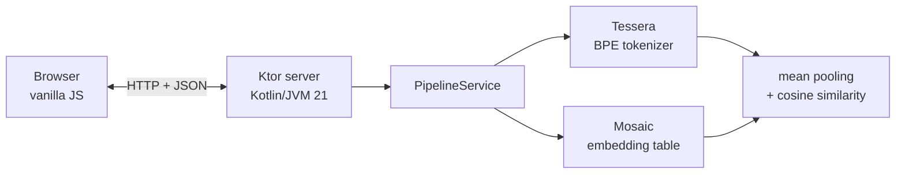

<p align="center">
  
</p>

<h1 align="center">nlp-kotlin-playground</h1>

<p align="center">
  An interactive playground demonstrating the <strong>Tessera + Mosaic</strong> NLP pipeline in pure Kotlin.<br/>
  <em>The third piece of a 3-repo ecosystem: where the tokenizer and the embedding table finally meet a user.</em>
</p>

<p align="center">
  <a href="https://github.com/HectorIFC/nlp-kotlin-playground/actions/workflows/ci.yml"></a>
  <a href="https://github.com/HectorIFC/nlp-kotlin-playground/pkgs/container/nlp-kotlin-playground"></a>
  <a href="https://github.com/HectorIFC/nlp-kotlin-playground/blob/main/LICENSE"></a>
  
  
  
</p>

---

## Watch the demo

<!--
  After recording the demo, replace the <video> src with the GitHub raw URL
  for the committed file. The repo path below is the default and works once
  docs/demo.mp4 is committed:
    https://github.com/HectorIFC/nlp-kotlin-playground/raw/main/docs/demo.mp4
-->

<video src="https://github.com/HectorIFC/nlp-kotlin-playground/raw/main/docs/demo.mp4" controls width="100%">
  Your browser does not support inline video.
  <a href="docs/demo.mp4">Download the 90-second walkthrough</a>.
</video>

> Roughly 90 seconds: pick a pre-trained corpus, run a semantic search, inspect tokens, compare two snippets. The full pipeline — Tessera (BPE) → Mosaic (embeddings) → cosine — running locally in a single Docker container.

## What is this?

A small web application that takes a corpus of text, **tokenizes** it with a BPE tokenizer ([Tessera](https://github.com/HectorIFC/tessera)), assigns each token a **lookup-table embedding** ([Mosaic](https://github.com/HectorIFC/mosaic)), and lets you explore the result through three interactions:

- **Search** — find the top-K most cosine-similar sentences for any query.
- **Tokenize** — see exactly how Tessera breaks a string into byte-level tokens.
- **Compare** — get the cosine similarity between any two strings.

Three corpora ship bundled (Alice in Wonderland, Shakespeare's Sonnets, a slice of the Kotlin stdlib KDocs), and any UTF-8 text up to 2&nbsp;MB can be uploaded to spin up a fresh pipeline in seconds.

The project exists for one reason: to make the libraries **tangible**. A recruiter or curious developer can click a link, run one Docker command, and *see* the pipeline working without ever opening a Kotlin file.

## Quick start

### Docker

```bash
docker run -p 8080:8080 ghcr.io/hectorifc/nlp-kotlin-playground:latest
```

Open [http://localhost:8080](http://localhost:8080).

The image is multi-stage (`eclipse-temurin:21-jre-jammy`) and weighs in well under 300&nbsp;MB.

### Local development

```bash
git clone https://github.com/HectorIFC/nlp-kotlin-playground.git
cd nlp-kotlin-playground
./gradlew run
```

Or build a distribution and run the binary directly:

```bash
./gradlew installDist
./build/install/nlp-kotlin-playground/bin/nlp-kotlin-playground
```

## The pipeline



A request to `/api/search/{sessionId}` walks through every box from left to right: Tessera converts both the query and the corpus sentences into token-ID sequences; Mosaic looks each ID up into a 128-dimensional vector; mean pooling produces one vector per sentence; cosine similarity ranks the sentences against the query.

See [ARCHITECTURE.md](./ARCHITECTURE.md) for the routes, the session store, the eviction policy, and how Tessera and Mosaic plug in.

## Limitations

> **About these results:** Mosaic provides embeddings as a *lookup table* — the vectors are randomly initialized, not trained. The pipeline (tokenization → vector lookup → mean pooling → cosine similarity) is real and identical to production-grade pipelines, but **without training, the similarities reflect random structure**, not semantic meaning. Training (Word2Vec / GloVe / etc) is a separate future project.

Concrete consequences worth knowing about:

- **Case and spelling matter.** Tessera is byte-level, and Mosaic vectors are random per token. `alice` and `Alice` map to different IDs and produce unrelated results.
- **Long sentences average toward zero.** A sentence's score is the *mean* of its token vectors; the more tokens, the closer the mean drifts to the origin. A sentence that literally contains your query word can still lose to a shorter, unrelated one by sheer luck of the seed.
- **This is not substring search.** It exercises the same plumbing that production semantic search uses — minus the part (training) that gives the plumbing meaning.

The playground showcases the *plumbing*, which is the harder part to build well in pure Kotlin without ML frameworks. Replacing the random-init step with a real training routine is the next project in this series.

## The bigger picture

A 3-repo Kotlin/JVM NLP ecosystem, all pure Kotlin, all under MIT:

| Project | Role | Status |
|---|---|---|
| [🧩 Tessera](https://github.com/HectorIFC/tessera) | Byte-level BPE tokenizer | v0.0.7 |
| [🎨 Mosaic](https://github.com/HectorIFC/mosaic) | Lookup-based token embeddings (depends on Tessera) | v0.0.4 |
| **nlp-kotlin-playground** *(you are here)* | Web application that demonstrates the pipeline end-to-end | active |

Both Tessera and Mosaic are consumed as **transitive JitPack dependencies** — no code is re-implemented in this repo. The whole point is to show what the two libraries look like in production-shaped wiring.

## Run locally

```bash
# Run the application
./gradlew run

# Run all tests (pipeline, sessions, HTTP routes, performance smoke)
./gradlew test

# Lint + static analysis (mirrors CI)
./gradlew ktlintCheck detekt

# Regenerate the bundled pre-trained corpora (rarely needed)
./gradlew runPretrain
```

The first build downloads the JDK 21 toolchain and the JitPack-built Tessera/Mosaic artifacts; subsequent builds are fast.

## HTTP API

The browser is the obvious client, but the JSON API stands on its own:

| Method | Path | Body | Returns |
|---|---|---|---|
| `GET`  | `/health` | — | `200 ok` |
| `GET`  | `/pretrained` | — | `{ available: [...] }` |
| `POST` | `/pretrained/{name}` | — | `{ sessionId, name }` |
| `POST` | `/upload` | `multipart/form-data` (`file` part, ≤ 2 MB UTF-8) | `{ sessionId, state: "training" }` |
| `GET`  | `/api/status/{sessionId}` | — | `{ sessionId, state, name?, error? }` |
| `POST` | `/api/search/{sessionId}` | `{ query, topK }` | `{ query, results: [{ sentence, score }] }` |
| `POST` | `/api/tokenize/{sessionId}` | `{ text }` | `{ text, tokens: [{ id, text }] }` |
| `POST` | `/api/similarity/{sessionId}` | `{ textA, textB }` | `{ textA, textB, score }` |

Sessions live in memory for one hour or until eviction; restarting the JVM discards everything.

## Architecture

See [ARCHITECTURE.md](./ARCHITECTURE.md) for the request flow, the pipeline service, the in-memory session store, and the rationale behind the Ktor + Docker + GHCR choices.

## License

MIT — see [LICENSE](./LICENSE).
