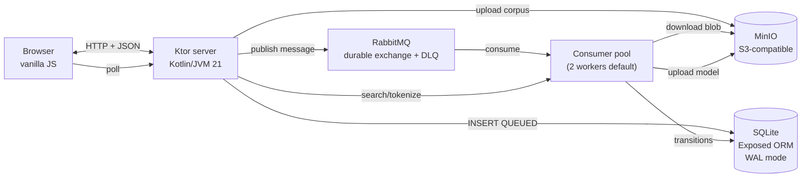

<p align="center">
  
</p>

<h1 align="center">nlp-kotlin-playground</h1>

<p align="center">
  An interactive playground demonstrating the <strong>Tessera + Mosaic</strong> NLP pipeline in pure Kotlin —<br/>
  now with a real distributed-systems backbone behind it.
</p>

<p align="center">
  <a href="https://hectorifc.github.io/nlp-kotlin-playground/"></a>
  <a href="https://github.com/HectorIFC/nlp-kotlin-playground/actions/workflows/ci.yml"></a>
  <a href="https://github.com/HectorIFC/nlp-kotlin-playground/pkgs/container/nlp-kotlin-playground"></a>
  <a href="https://github.com/HectorIFC/nlp-kotlin-playground/blob/main/LICENSE"></a>
  
  
  
</p>

> ⚠️ **v0.1.0 is a breaking change.** The synchronous in-memory model from v0.0.x has been replaced by a queue-based distributed architecture. Path params changed from `{sessionId}` to `{trainingId}`, `/upload` returns `202 Accepted` instead of blocking. See [CHANGELOG.md](./CHANGELOG.md) for the full migration notes.

---

## Watch the demo

<video src="docs/demo.mp4" controls width="100%">
  Your browser does not support inline video.
  <a href="docs/demo.mp4">Download the walkthrough</a>.
</video>

> A 75-90 second tour of v0.1.0: corpus upload → message lands in RabbitMQ → consumer pulls from MinIO → SQLite tracks every transition → search runs against the cached pipeline. Plus a failure demo where a malformed corpus lands in the DLQ.

## What is this?

A Kotlin/JVM web application that takes a corpus of text, tokenizes it with **byte-level BPE** ([Tessera](https://github.com/HectorIFC/tessera)), assigns each token a **lookup-table embedding** ([Mosaic](https://github.com/HectorIFC/mosaic)), and exposes it through three interactions in a browser:

- **Search** — top-K cosine-similar sentences for any query.
- **Tokenize** — show how Tessera breaks a string into byte-level tokens.
- **Compare** — cosine similarity between any two strings.

What changed in v0.1.0 is **how the pipeline runs**. Uploads no longer block the HTTP thread for 30-60 seconds while BPE trains. Instead the request returns immediately with a `training_id`, the corpus is dropped into MinIO, a message goes to RabbitMQ, and a worker pool drains the queue at its own pace. Every state transition is persisted to SQLite, every artifact is uploaded back to MinIO, and the frontend dashboard reflects it in real time.

Three corpora ship bundled (Alice in Wonderland, Shakespeare's Sonnets, a slice of Kotlin stdlib KDocs) — those skip the queue and are persisted as `READY` rows directly, but consume the same `/api/.../{trainingId}` surface as uploaded corpora.

The whole stack — app + MinIO + RabbitMQ + SQLite — runs from a single `docker compose up`.

## Quick start

```bash
git clone https://github.com/HectorIFC/nlp-kotlin-playground.git
cd nlp-kotlin-playground
docker compose up
```

Open the apps:

- **Playground**: http://localhost:8080
- **Trainings dashboard**: http://localhost:8080/trainings
- **MinIO console**: http://localhost:9001 (user `playground` / pass `playground123`)
- **RabbitMQ management**: http://localhost:15672 (guest / guest)
- **Metrics**: http://localhost:8080/metrics (Prometheus text format)

Or pull the published image directly:

```bash
docker pull ghcr.io/hectorifc/nlp-kotlin-playground:latest
# you still need MinIO and RabbitMQ running — docker-compose.yml is the easiest way.
```

## Architecture



`POST /upload` returns `202 Accepted` immediately. The consumer pool walks the corpus through `QUEUED → DOWNLOADING → TOKENIZING → EMBEDDING → INDEXING → READY`, persisting every transition to SQLite (Exposed). Once the model lands in `trained-models/{trainingId}/`, search requests resolve against a small LRU cache that streams artifacts from MinIO on demand. Failures route to a dead-letter queue for manual inspection — the consumer never silently retries.

See [ARCHITECTURE.md](./ARCHITECTURE.md) for the full request flow, the state machine, the idempotency guarantees and the rationale behind every component choice.

## Why this architecture?

Three deliberate trade-offs worth calling out:

- **MinIO over filesystem** — corpora and model artifacts live in object storage with TTL rules (1 day on uploads, 1 day on models) instead of a shared volume. Decouples the producer and consumer pods; surfaces real S3-style code paths without standing up AWS.
- **SQLite + Exposed over Postgres** — the playground is single-tenant and the dataset is tiny; a single SQLite file in WAL mode handles two concurrent consumers comfortably. Exposed's DSL keeps the persistence layer idiomatic Kotlin with zero JDBC plumbing.
- **HTTP polling over SSE/WebSockets** — at 2-3 s intervals the dashboard is responsive enough for a demo, and polling fits neatly inside the existing JSON API. SSE is a stretch goal for v0.2.

The whole "consumer + queue + storage" stack adds about 60 MB to the final image and ~3 seconds to cold startup compared to v0.0.3. It's worth it because the architecture lessons it demonstrates — durable queues, idempotent consumers, state machines, graceful shutdown — are the actual portfolio signal.

## Limitations

> **About these results:** Mosaic provides embeddings as a *lookup table* — the vectors are randomly initialized, not trained. The pipeline (tokenization → vector lookup → mean pooling → cosine similarity) is real and identical to production-grade pipelines, but **without training, the similarities reflect random structure**, not semantic meaning. Training (Word2Vec / GloVe / etc) is a separate future project.

Concrete consequences worth knowing about:

- **Case and spelling matter.** Tessera is byte-level and Mosaic vectors are random per token: `alice` and `Alice` map to different IDs and produce unrelated results.
- **Long sentences average toward zero.** A sentence's score is the *mean* of its token vectors; the more tokens, the closer the mean drifts to the origin. A sentence that literally contains your query word can lose to a shorter, unrelated one by luck of the seed.
- **This is not substring search.** It exercises the same plumbing production semantic search uses — minus the training step that gives the plumbing meaning.

## The bigger picture

A 3-repo Kotlin/JVM NLP ecosystem, all pure Kotlin, all under MIT:

| Project | Role | Status |
|---|---|---|
| [🧩 Tessera](https://github.com/HectorIFC/tessera) | Byte-level BPE tokenizer | v0.0.7 |
| [🎨 Mosaic](https://github.com/HectorIFC/mosaic) | Lookup-based token embeddings (depends on Tessera) | v0.0.4 |
| **nlp-kotlin-playground** *(you are here)* | Distributed-architecture web app demonstrating the pipeline end-to-end | v0.1.0 |

Both Tessera and Mosaic are consumed as **JitPack dependencies** — no code is re-implemented here. The whole point is to show how the libraries look when wired into something production-shaped.

## Run locally

```bash
# Full stack via compose (default)
docker compose up

# JVM-only (you provide MinIO + RabbitMQ on localhost)
./gradlew run

# Tests, lint, static analysis
./gradlew test ktlintCheck detekt

# Regenerate the bundled pre-trained corpora (rare — only when the
# Tessera/Mosaic versions change or a corpus is added)
./gradlew runPretrain
```

Useful env vars (defaults match the compose file):

| Variable | Default | Purpose |
|---|---|---|
| `MINIO_ENDPOINT` | `http://minio:9000` | MinIO URL |
| `MINIO_ACCESS_KEY`, `MINIO_SECRET_KEY` | `playground` / `playground123` | MinIO creds |
| `RABBITMQ_HOST`, `RABBITMQ_PORT` | `rabbitmq` / `5672` | AMQP broker |
| `RABBITMQ_USER`, `RABBITMQ_PASS` | `guest` / `guest` | RabbitMQ creds |
| `SQLITE_PATH` | `/data/playground.db` | DB file (volume-backed in compose) |
| `CONSUMER_CONCURRENCY` | `2` | Parallel workers draining the queue |
| `MAX_CORPUS_SIZE_BYTES` | `2097152` (2 MB) | Hard upload limit |
| `TRAINING_TTL_HOURS` | `24` | TTL before READY trainings move to EXPIRED |
| `LOG_FORMAT` | `json` | Switch to `plain` for human-readable terminal logs |

## HTTP API

| Method | Path | Body | Returns |
|---|---|---|---|
| `GET`  | `/health` | — | `200` when SQLite + MinIO + RabbitMQ are all reachable, `503` otherwise |
| `GET`  | `/pretrained` | — | `{ available: [name, …] }` |
| `POST` | `/pretrained/{name}` | — | `201 { trainingId, name }` — bundled corpora are persisted as a READY training row |
| `POST` | `/upload` | `multipart/form-data` (`file` ≤ 2 MB UTF-8) | `202 { trainingId, status, statusUrl, progressUrl }` |
| `GET`  | `/api/training/{id}` | — | training detail + event timeline |
| `GET`  | `/api/trainings` | — | paginated list, filter by `status=` + `since=` + `limit=` |
| `GET`  | `/api/trainings/active` | — | non-terminal trainings only |
| `POST` | `/api/search/{trainingId}` | `{ query, topK }` | top-K hits sorted by cosine similarity |
| `POST` | `/api/tokenize/{trainingId}` | `{ text }` | tokens + IDs |
| `POST` | `/api/similarity/{trainingId}` | `{ textA, textB }` | cosine score |
| `GET`  | `/metrics` | — | Prometheus text counters |

## License

MIT — see [LICENSE](./LICENSE).
